# About Me

Hi👋 My name is Amirhossein Esmaeili but you can call me **Amir**.

I'm a software engineer based in the UK. I have a passion for creating software
that is both functional and beautiful. I have experience with a variety of
technologies and I'm always looking to learn more. I like playing video games,
making video games, 3D websites and biking 🚴‍♂️.

## Work Experiences

You can
[download](https://raw.githubusercontent.com/amirhh00/amirhh00/refs/heads/main/static/software-engineer.pdf)
or [view](https://amirhossein-esmaeili.com/resume) my resume.

## Projects

_**To see more, visit my [Website](amirhossein-esmaeili.com)**_.

### WGSL101

WGSL101 is a web application designed to teach the WGSL language, which is used
for writing shaders in WebGPU. Developed as my dissertation project, this
application serves both students and developers.

The platform features a code editor with syntax highlighting, code completion,
and AI-powered explanations for WGSL code. Users can write and execute shaders
in real-time, viewing the results directly in their browser.

Additionally, WGSL101 offers a tutorial section with lessons and exercises to
facilitate learning. Users can take quizzes to test their knowledge, track their
progress, and utilize AI assistance throughout their learning journey.

**worked on**: frontend,backend,UI&#x2F;UX

**tools used**: React,NextJs,Zustand,Shadcn&#x2F;ui,PostgreSQL,Node.js,OpenAI API,TypeScript

<video width="320" controls loop muted autoplay>
<source src="https://raw.githubusercontent.com/amirhh00/amirhh00/refs/heads/main/src/static/projects/wgsl101/2024-12-18 22-38-13.mp4" type="video/mp4">
</video>

<video width="320" controls loop muted autoplay>
<source src="https://raw.githubusercontent.com/amirhh00/amirhh00/refs/heads/main/src/static/projects/wgsl101/2024-12-18 22-34-25.mp4" type="video/mp4">
</video>

<video width="320" controls loop muted autoplay>
<source src="https://raw.githubusercontent.com/amirhh00/amirhh00/refs/heads/main/src/static/projects/wgsl101/2024-12-18 22-20-58.mp4" type="video/mp4">
</video>

<video width="320" controls loop muted autoplay>
<source src="https://raw.githubusercontent.com/amirhh00/amirhh00/refs/heads/main/src/static/projects/wgsl101/admin_panel.mp4" type="video/mp4">
</video>

<video width="320" controls loop muted autoplay>
<source src="https://raw.githubusercontent.com/amirhh00/amirhh00/refs/heads/main/src/static/projects/wgsl101/2024-12-18 22-35-15.mp4" type="video/mp4">
</video>

<video width="320" controls loop muted autoplay>
<source src="https://raw.githubusercontent.com/amirhh00/amirhh00/refs/heads/main/src/static/projects/wgsl101/2024-12-18 22-18-52.mp4" type="video/mp4">
</video>

<video width="320" controls loop muted autoplay>
<source src="https://raw.githubusercontent.com/amirhh00/amirhh00/refs/heads/main/src/static/projects/wgsl101/2024-12-18 22-37-44.mp4" type="video/mp4">
</video>

### 3DWebRTC

3DWebRTC is a web multiplayer game that uses WebRTC for real-time communication
and Three.js for 3D rendering. Players can join and navigate through the scene.
Players can see each other in real-time and communicate using voice chat.

**worked on**: frontend,backend

**tools used**: Svelte,Three.js,WebRTC,WebSockets,Bunjs,Hono,cloudflare workers,postgreSQL,DrizzleORM

<video width="320" controls loop muted autoplay>
<source src="https://raw.githubusercontent.com/amirhh00/amirhh00/refs/heads/main/src/static/projects/3DWebRTC/2024-12-18 22-56-52.mp4" type="video/mp4">
</video>

<video width="320" controls loop muted autoplay>
<source src="https://raw.githubusercontent.com/amirhh00/amirhh00/refs/heads/main/src/static/projects/3DWebRTC/2024-11-05 22-27-21.mp4" type="video/mp4">
</video>

### Schilte

[Schilte](https:&#x2F;&#x2F;configurator.schilte.nl) is a web application designed for creating customizable 3D cabinet models. Users can modify the cabinet&#39;s dimensions, colors, and materials, as well as add features like shelves, doors, and drawers. The application allows users to view and rotate the cabinet in 3D, save their designs, and share them with others.
Additionally, APIs were developed using Strapi, allowing the owner to manage prices and products through an intuitive dashboard interface.

**worked on**: frontend,backend

**tools used**: React,NextJs,Three.js,Strapi,Zustand,TailwindCSS,Node.js,TypeScript

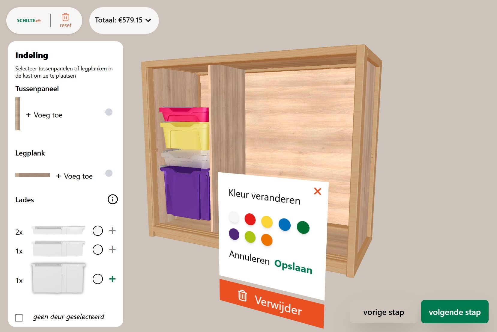

<video width="320" controls loop muted autoplay>
<source src="https://raw.githubusercontent.com/amirhh00/amirhh00/refs/heads/main/src/static/projects/schilte/2024-12-18 23-00-19.mp4" type="video/mp4">
</video>

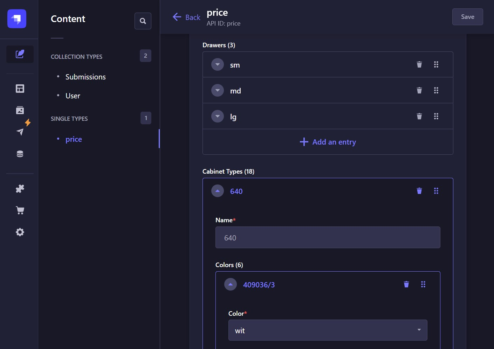

### Quick Part

The Quick Parts Price Search application is a robust platform designed to empower sellers by providing real-time pricing information for a wide range of auto parts. With an intuitive interface, users can efficiently search for specific components, compare prices, and place orders seamlessly. This streamlined process not only enhances the shopping experience but also facilitates informed decision-making, ensuring that sellers can manage their inventory and procurement with ease.

**worked on**: frontend,panel

**tools used**: Flutter,React,NextJs,Redux,Material-UI,Node.js,TypeScript,WordPress API

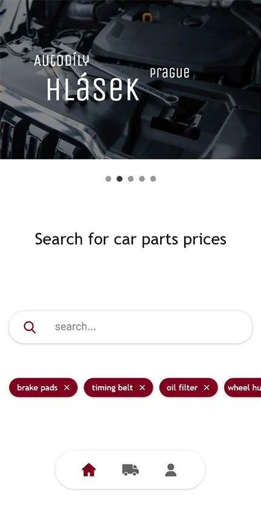

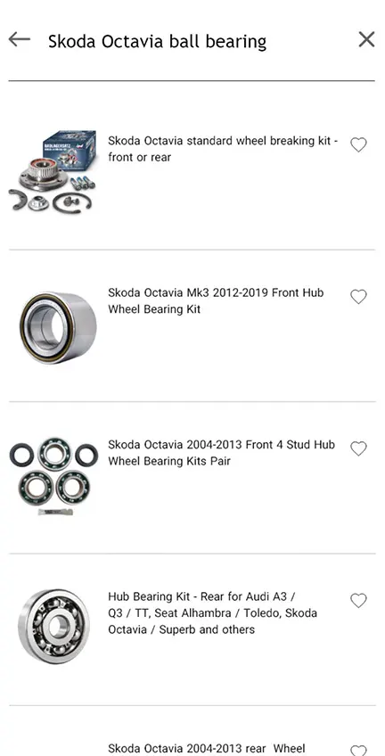

<video width="320" controls loop muted autoplay>
<source src="https://raw.githubusercontent.com/amirhh00/amirhh00/refs/heads/main/src/static/projects/quick-part/5.mp4" type="video/mp4">
</video>

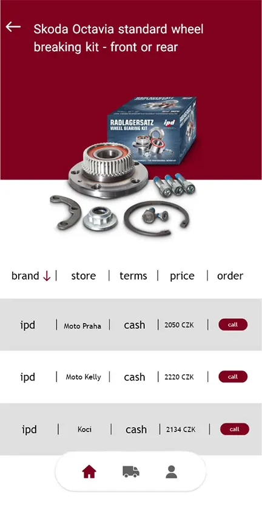

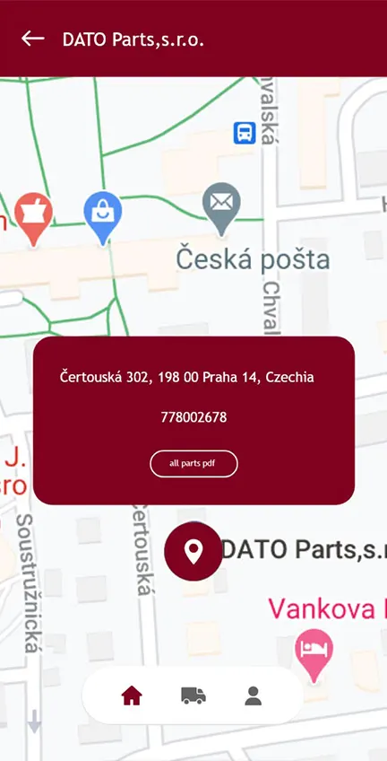

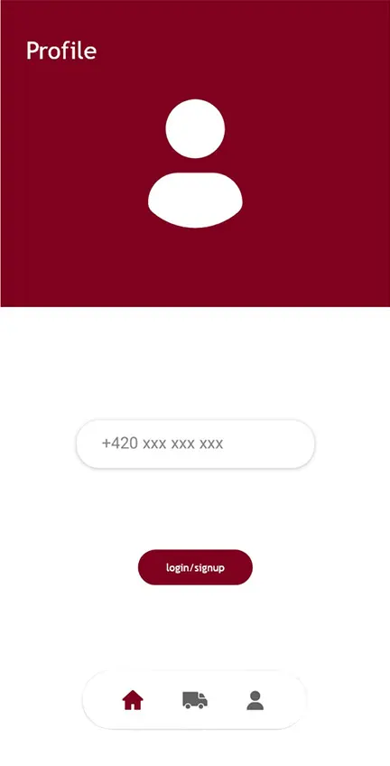

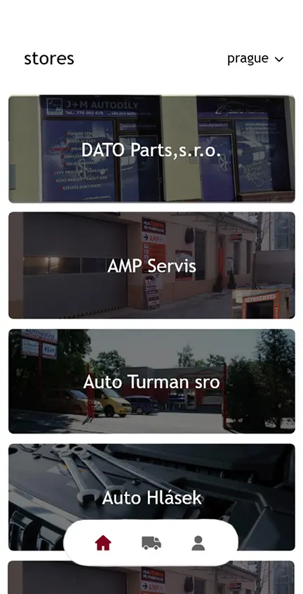

### FireDetect

FireDetect web application for monitoring fire detects modules on the map
developed with the ability to model the IoT modules and users, buildings, units
data.

**worked on**: frontend

**tools used**: React,NextJs,Redux,Material-UI,Node.js,TypeScript

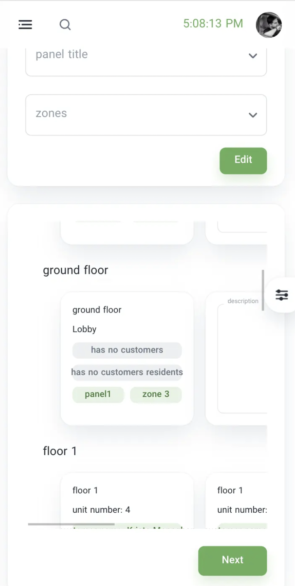

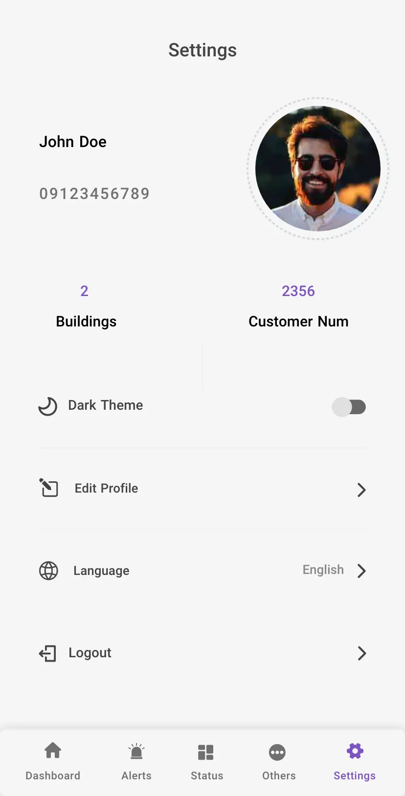

<video width="320" controls loop muted autoplay>
<source src="https://raw.githubusercontent.com/amirhh00/amirhh00/refs/heads/main/src/static/projects/firedetect/add-module.mp4" type="video/mp4">
</video>

<video width="320" controls loop muted autoplay>
<source src="https://raw.githubusercontent.com/amirhh00/amirhh00/refs/heads/main/src/static/projects/firedetect/edit-building.mp4" type="video/mp4">
</video>

<video width="320" controls loop muted autoplay>
<source src="https://raw.githubusercontent.com/amirhh00/amirhh00/refs/heads/main/src/static/projects/firedetect/edit-page.mp4" type="video/mp4">
</video>

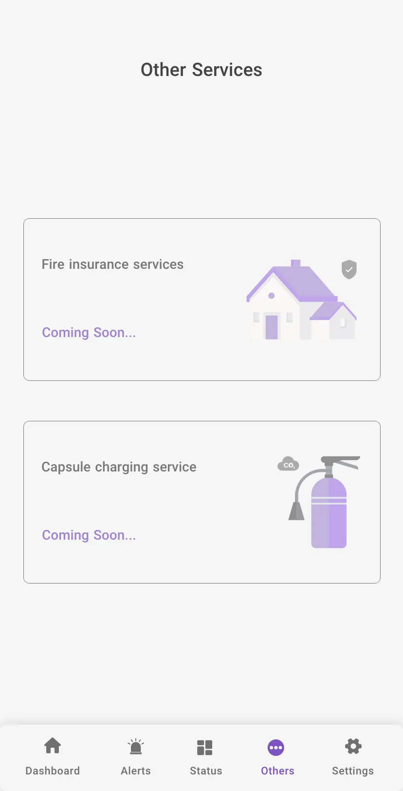

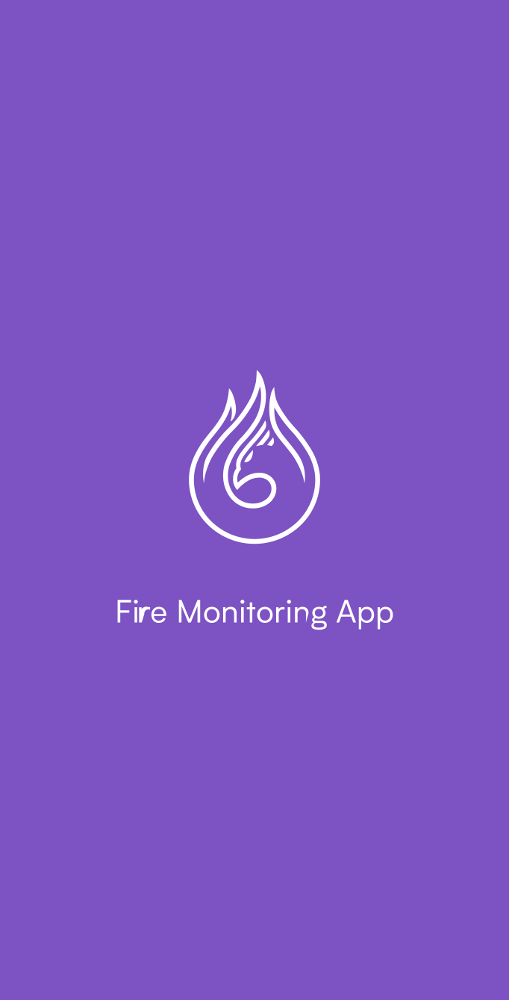

<video width="320" controls loop muted autoplay>
<source src="https://raw.githubusercontent.com/amirhh00/amirhh00/refs/heads/main/src/static/projects/firedetect/user-management.mp4" type="video/mp4">
</video>

<video width="320" controls loop muted autoplay>
<source src="https://raw.githubusercontent.com/amirhh00/amirhh00/refs/heads/main/src/static/projects/firedetect/edit-building3.mp4" type="video/mp4">
</video>

<video width="320" controls loop muted autoplay>
<source src="https://raw.githubusercontent.com/amirhh00/amirhh00/refs/heads/main/src/static/projects/firedetect/edit-building2.mp4" type="video/mp4">
</video>

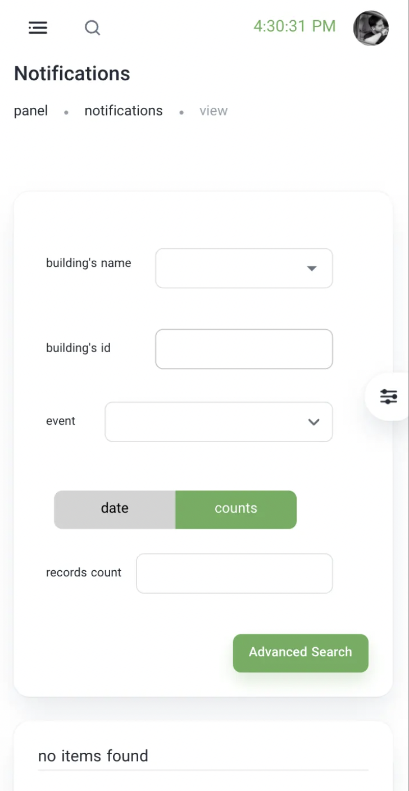

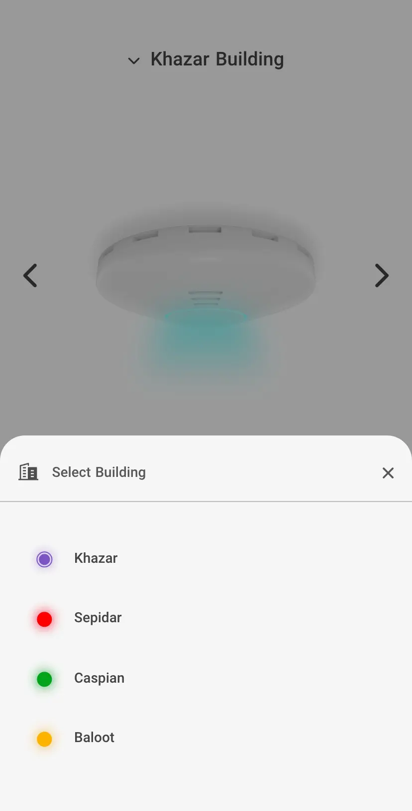

<video width="320" controls loop muted autoplay>
<source src="https://raw.githubusercontent.com/amirhh00/amirhh00/refs/heads/main/src/static/projects/firedetect/home-page.mp4" type="video/mp4">
</video>

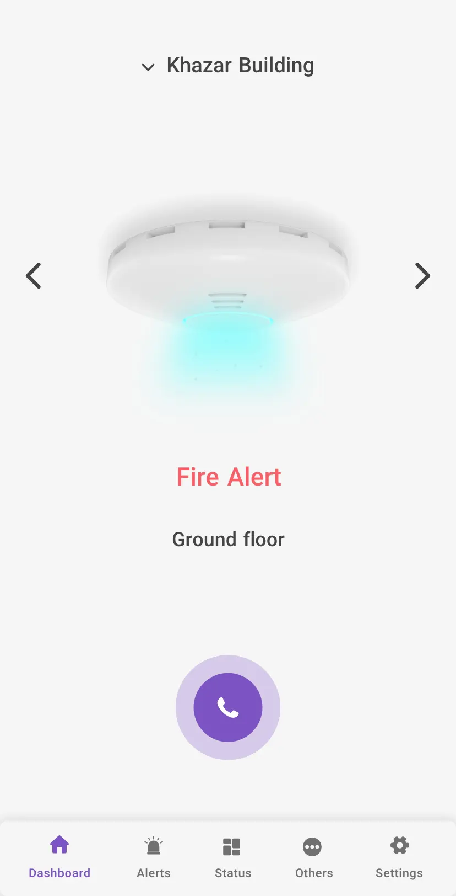

<video width="320" controls loop muted autoplay>
<source src="https://raw.githubusercontent.com/amirhh00/amirhh00/refs/heads/main/src/static/projects/firedetect/profile-fire-detect.mp4" type="video/mp4">
</video>

<video width="320" controls loop muted autoplay>
<source src="https://raw.githubusercontent.com/amirhh00/amirhh00/refs/heads/main/src/static/projects/firedetect/add-simcard.mp4" type="video/mp4">
</video>

<video width="320" controls loop muted autoplay>
<source src="https://raw.githubusercontent.com/amirhh00/amirhh00/refs/heads/main/src/static/projects/firedetect/edit-building4.mp4" type="video/mp4">
</video>

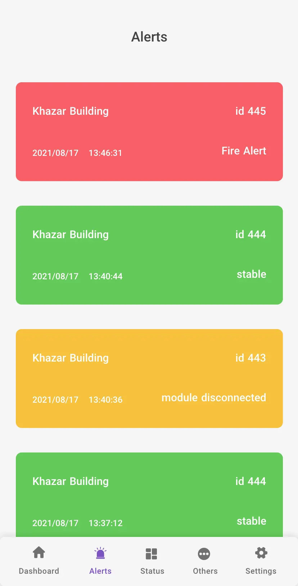

<video width="320" controls loop muted autoplay>
<source src="https://raw.githubusercontent.com/amirhh00/amirhh00/refs/heads/main/src/static/projects/firedetect/add-building.mp4" type="video/mp4">
</video>

### S&amp;L

An online 2 player snake and ladder game with some special challenges and a
different interface. The logic was implemented in the backend using WebSocket
and the frontend was responsible for the UI and the game flow.

**worked on**: frontend,backend

**tools used**: React,NextJs,Redux,Material-UI,Node.js,TypeScript,socket.io

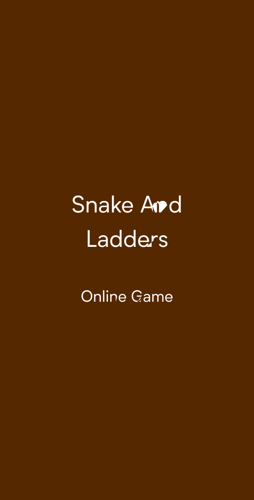

<video width="320" controls loop muted autoplay>
<source src="https://raw.githubusercontent.com/amirhh00/amirhh00/refs/heads/main/src/static/projects/snake-and-ladders/2.mp4" type="video/mp4">
</video>

### FireDetect

Stylett is an ecommerce application in which producers can offer their products
with the possibility of personalizing and customizing the product for customers.

**worked on**: frontend

**tools used**: React,Redux,Material-UI,TypeScript

<video width="320" controls loop muted autoplay>
<source src="https://raw.githubusercontent.com/amirhh00/amirhh00/refs/heads/main/src/static/projects/stylett/customize2-stylett.mp4" type="video/mp4">
</video>

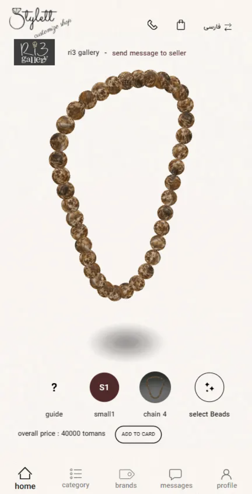

<video width="320" controls loop muted autoplay>
<source src="https://raw.githubusercontent.com/amirhh00/amirhh00/refs/heads/main/src/static/projects/stylett/customize-stylett.mp4" type="video/mp4">
</video>

<video width="320" controls loop muted autoplay>
<source src="https://raw.githubusercontent.com/amirhh00/amirhh00/refs/heads/main/src/static/projects/stylett/homepage-stylett.mp4" type="video/mp4">
</video>

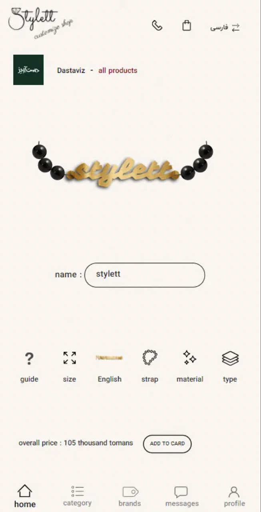

<video width="320" controls loop muted autoplay>
<source src="https://raw.githubusercontent.com/amirhh00/amirhh00/refs/heads/main/src/static/projects/stylett/customize4-stylett.mp4" type="video/mp4">
</video>

<video width="320" controls loop muted autoplay>
<source src="https://raw.githubusercontent.com/amirhh00/amirhh00/refs/heads/main/src/static/projects/stylett/customize3-stylett.mp4" type="video/mp4">
</video>

### Pasco

Pasco application is a solution for collecting waste by inspiring the users with
gamification in the app and give them coins that they can cash out them.

**worked on**: Mobile Application,Web

**tools used**: React,React Native,JQuery,Bootstrap

<video width="320" controls loop muted autoplay>
<source src="https://raw.githubusercontent.com/amirhh00/amirhh00/refs/heads/main/src/static/projects/pasco/3.mp4" type="video/mp4">
</video>

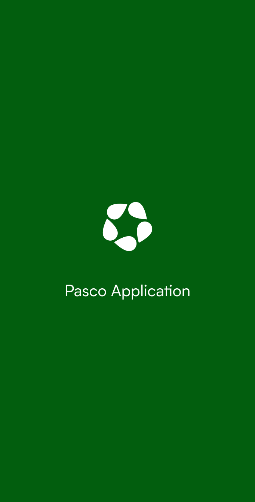

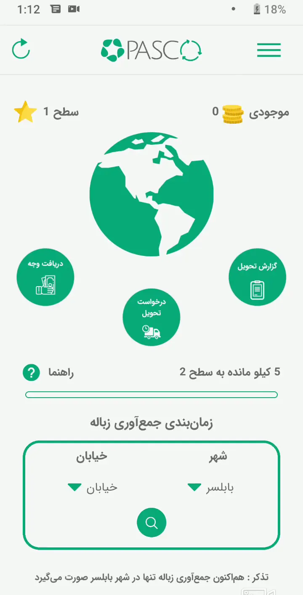

<video width="320" controls loop muted autoplay>
<source src="https://raw.githubusercontent.com/amirhh00/amirhh00/refs/heads/main/src/static/projects/pasco/2.mp4" type="video/mp4">
</video>

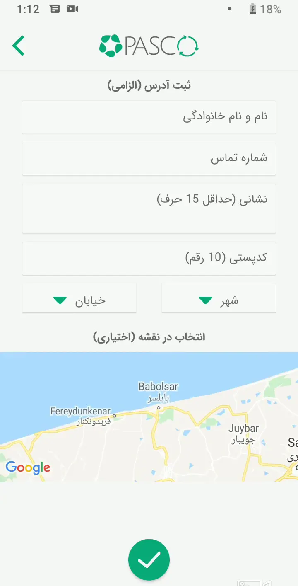

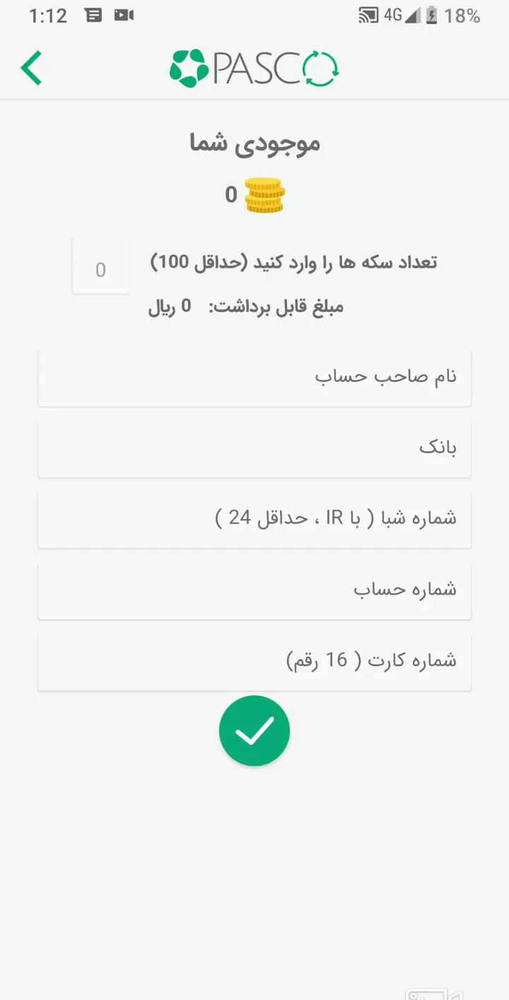

### RealUp

Realup is a VR&#x2F;AR video-sharing application that was the first VR&#x2F;Ar app in
Iran. This app also uses in a variety of schools for teaching purposes.

**worked on**: frontend

**tools used**: React,Redux,Angular

<video width="320" controls loop muted autoplay>
<source src="https://raw.githubusercontent.com/amirhh00/amirhh00/refs/heads/main/src/static/projects/realup/3.mp4" type="video/mp4">
</video>

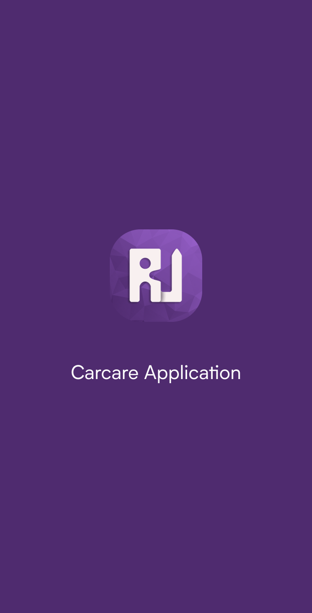

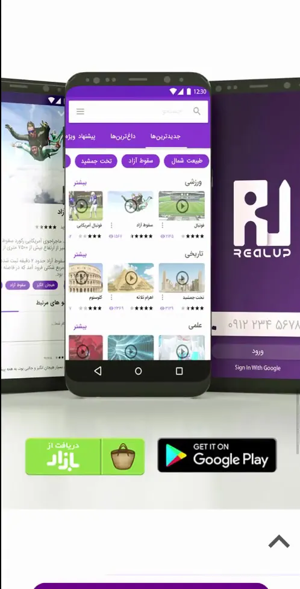

<video width="320" controls loop muted autoplay>
<source src="https://raw.githubusercontent.com/amirhh00/amirhh00/refs/heads/main/src/static/projects/realup/2.mp4" type="video/mp4">
</video>

## Contact Me

You can contact me via email at
[contact@amirhossein-esmaeili.com](mailto:contact@amirhossein-esmaeili.com).

Or you can find me on
[LinkedIn](https://www.linkedin.com/in/amirhossein-esmaeili/),
[GitHub](https://github.com/amirhh00), [Telegram](https://t.me/esy96).
